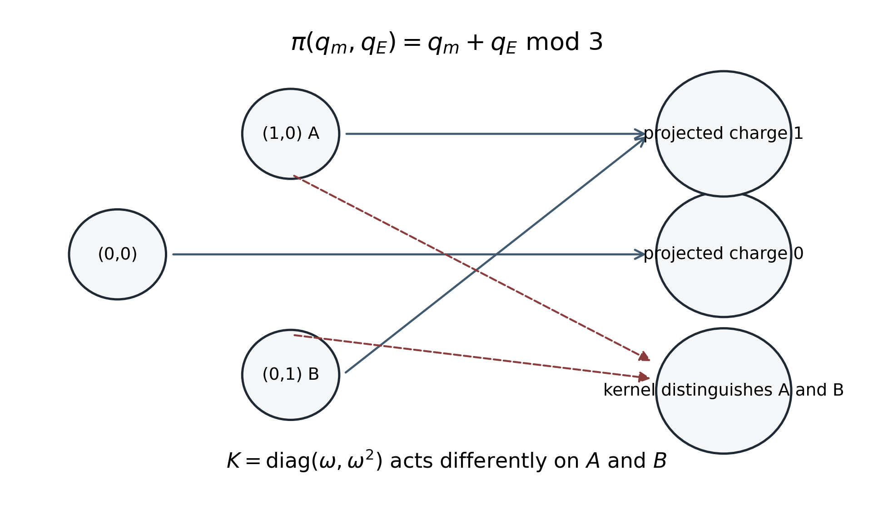
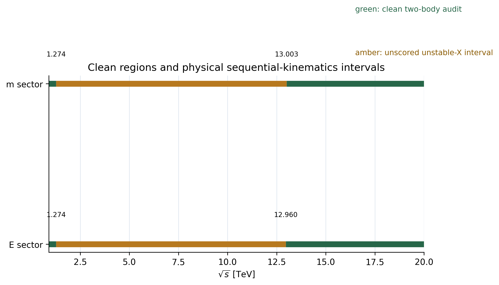
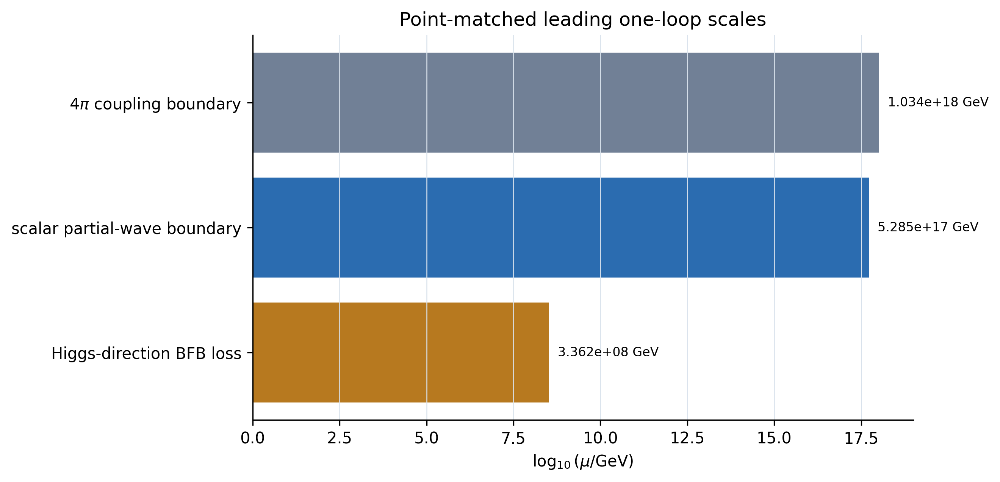

# Introduction

Discrete symmetries provide economical ways to stabilize dark-sector particles, constrain renormalizable interactions, and organize semi-annihilation and conversion processes. The ingredients used here are standard: finite Abelian groups, complex scalar singlets, Higgs portals, residual discrete gauge symmetries, and coupled thermal freeze-out. The question addressed in this work is narrower. If two fields have the same charge under a projected $Z_3$ but different charges under the kernel of a product group, what operator pattern and observable consequences remain after the theory is written in a basis-independent form and subjected to a complete benchmark audit?

We study

$$
G_{\mathrm TP-D}=Z_3^{(m)}\times Z_3^{(E)}
\cong Z_3^{(P)}\times Z_3^{(K)}
$$

with two Standard-Model-singlet complex scalars $A$ and $B$. The labels $m$ and $E$ are historical names for internal charges. They do not denote the sign of mass or energy and have no kinematic interpretation. The physically relevant structure is the projection

$$
\pi(q_m,q_E)=q_m+q_E\pmod 3
$$

and its nontrivial kernel. Both dark scalars carry projected charge one, while their kernel charges differ. A theory that retains only the projected $Z_3$ permits mixing and transition operators that the full product symmetry forbids.

This distinction is easy to state and easy to overstate. A diagonal mass matrix in one field basis is not evidence for an additional symmetry. The invariant statement is that one noncentral order-three transformation leaves the kinetic, mass, cubic, quartic, and portal tensors invariant simultaneously. This produces an exact pattern of operator zeros and kernel-changing selection rules. It does not make the abstract group new, and a null transition cannot by itself distinguish a symmetry-protected zero from an accidental tuning.

The second purpose of this work is methodological. We retain negative results and apply the experimental and consistency gates in dependency order. A baseline benchmark that is healthy at tree level fails thermally. A constrained scan finds four points near the observed relic density, but abundance-weighted direct detection excludes all four. The equations then motivate a reduced search near the Standard Model Higgs resonance, where annihilation can be enhanced without a comparable increase in elastic scattering. One conditionally viable point survives the final set of checks.

The scope is an audited effective field theory and one matched residual-gauge parent slice. We make no claim of a fundamental theory, unification, quantum gravity, an explanation of fermion generations, or a derivation of constants. The strongest result is the coexistence of an exact kernel-sensitive operator pattern with one internally consistent numerical dark-matter benchmark, subject to stated perturbative and phenomenological limitations.

# Symmetry architecture

## Projection and kernel

Let $\omega=e^{2\pi i/3}$. The dark fields have charges

| Field | $q_m$ | $q_E$ | $q_P=q_m+q_E$ | $q_K=q_m-q_E$ |
|---|---:|---:|---:|---:|
| $H$ and all SM fields | 0 | 0 | 0 | 0 |
| $A$ | 1 | 0 | 1 | 1 |
| $B$ | 0 | 1 | 1 | 2 |

The projection is surjective and

$$
\ker\pi=\{(0,0),(1,2),(2,1)\}\cong Z_3.
$$

In the two-field space $\Phi=(A,B)^T$, useful generators are

$$
P=\omega I_2,\qquad K=\operatorname{diag}(\omega,\omega^2).
$$

The change from $(q_m,q_E)$ to $(q_P,q_K)$ is invertible over $\mathbb F_3$, since the transformation matrix has nonzero determinant modulo three. Thus the projected and kernel charges are equivalent coordinates on the same product group, not extra degrees of freedom.

## Basis-independent meaning

Under a field redefinition $\Phi\to U\Phi$, the representation matrix and every coupling tensor transform together. For a quadratic tensor $M^2$,

$$
M^2\to U M^2 U^\dagger,\qquad K\to UKU^\dagger .
$$

The invariant statement is the existence of a single $K\not\propto I$, with $K^3=I$, that satisfies the appropriate tensor-invariance equation for every term in the action. For the mass tensor,

$$
K^\dagger M^2K=M^2.
$$

Analogous equations hold for the cubic, quartic, kinetic, and Higgs-portal tensors. A useful nonnegative residual is

$$
I_M(K)=\operatorname{Tr}\!\left[
(K^\dagger M^2K-M^2)^\dagger(K^\dagger M^2K-M^2)
\right],
$$

with simultaneous zero residuals required for the complete interaction set. This prevents the construction from being reduced to a basis choice that diagonalizes one matrix.

# Canonical TP-D effective field theory

## Action and parameters

The renormalizable scalar action is

$$
\mathcal L=\mathcal L_{\mathrm SM}+|\partial_\mu A|^2+|\partial_\mu B|^2-V,
$$

$$
\begin{aligned}
V={}&-m_H^2H^\dagger H+\lambda_H(H^\dagger H)^2
+m_A^2|A|^2+m_B^2|B|^2\\
&+\left[\frac{\mu_A}{3}A^3+\frac{\mu_B}{3}B^3+\mathrm{h.c.}\right]
+\lambda_A|A|^4+\lambda_B|B|^4+\lambda_{AB}|A|^2|B|^2\\
&+\lambda_{HA}(H^\dagger H)|A|^2
+\lambda_{HB}(H^\dagger H)|B|^2.
\end{aligned}
$$

Independent rephasings make $\mu_A$ and $\mu_B$ real. The non-SM physical continuous parameter set is

$$
\{m_A^2,m_B^2,\mu_A,\mu_B,\lambda_A,\lambda_B,
\lambda_{AB},\lambda_{HA},\lambda_{HB}\},
$$

containing nine parameters. The inert branch has

$$
\langle H\rangle=\frac{1}{\sqrt2}(0,v)^T,\qquad
\langle A\rangle=\langle B\rangle=0,
$$

and physical tree masses

$$
M_A^2=m_A^2+\frac12\lambda_{HA}v^2,\qquad
M_B^2=m_B^2+\frac12\lambda_{HB}v^2.
$$

## Generic projected-Z3 comparator

If only $P=\omega I_2$ is imposed, the kinetic matrix may be a general positive Hermitian matrix before canonicalization, the mass and Higgs-portal tensors may be general Hermitian matrices, and the cubic and quartic tensors admit mixed structures. After canonicalizing the kinetic term and quotienting by the common $U(2)$ basis freedom, the stated comparator has 21 physical continuous parameters. Exact TP-D has 9, so

$$
\Delta N_{\mathrm phys}=12.
$$

This is parameter compression through symmetry-enforced zeros. It is not a numerical sum rule and does not imply that the remaining nine parameters are predicted.

# Operator restrictions

The complete nonderivative enumeration through dimension four distinguishes the full product theory from its projected comparator. Representative comparator-only structures are listed below.

| Operator class | Generic projected $Z_3$ | Exact TP-D | Physical role if present |
|---|:---:|:---:|---|
| $\partial_\mu A^\dagger\partial^\mu B+\mathrm{h.c.}$ | allowed | forbidden | kinetic mixing |
| $A^\dagger B+\mathrm{h.c.}$ | allowed | forbidden | mass mixing and oscillation |
| $A^2B+\mathrm{h.c.}$ | allowed | forbidden | mixed cubic transition |
| $AB^2+\mathrm{h.c.}$ | allowed | forbidden | mixed cubic transition |
| $|A|^2A^\dagger B+\mathrm{h.c.}$ | allowed | forbidden | flavor-changing scattering |
| $|B|^2A^\dagger B+\mathrm{h.c.}$ | allowed | forbidden | flavor-changing scattering |
| $(A^\dagger B)^2+\mathrm{h.c.}$ | allowed | forbidden | pair conversion |
| $(H^\dagger H)A^\dagger B+\mathrm{h.c.}$ | allowed | forbidden | Higgs-mediated transition |

Every exact-TP-D vertex has vanishing total vector charge. Charge conservation at every internal contraction therefore forbids counterterms with nonzero external vector charge. In a symmetry-preserving regulator and subtraction scheme, the forbidden-operator surface is perturbatively invariant.

# Exact kernel selection rules

Let $X_0$ denote any collection of kernel-neutral external states. Since the S matrix commutes with $K$, matrix elements between states with different kernel eigenvalues vanish:

$$
\mathcal M(B\to A+X_0)=0.
$$

In particular,

$$
\mathcal M(B\to A+h)=0.
$$

This is an all-orders selection rule of exact TP-D. Its empirical interpretation requires care. A statistically significant nonzero kernel-changing transition would falsify the exact theory if the observed states were independently established as the TP-D charge eigenstates and the kernel were neither explicitly nor spontaneously broken. A null result would not identify TP-D, because the generic comparator can tune its allowed transition couplings to zero.

The frozen Higgs-pole benchmark contains no concrete production and tagging sector for this transition. The selection rule is therefore formally falsifiable but not yet experimentally actionable.

# Vacuum and spectrum

Define $x=H^\dagger H$, $y=|A|^2$, and $z=|B|^2$. The quartic potential is the quadratic form associated with

$$
Q=\begin{pmatrix}
\lambda_H&\lambda_{HA}/2&\lambda_{HB}/2\\
\lambda_{HA}/2&\lambda_A&\lambda_{AB}/2\\
\lambda_{HB}/2&\lambda_{AB}/2&\lambda_B
\end{pmatrix}.
$$

Boundedness is equivalent to copositivity of $Q$. A simple sufficient global-inert certificate, useful for the positive-portal benchmarks studied here, consists of positive quadratic masses for $A$ and $B$, nonnegative portals, exact copositivity, and

$$
|\mu_A|^2\leq9\lambda_A m_A^2,\qquad
|\mu_B|^2\leq9\lambda_B m_B^2.
$$

These inequalities follow by minimizing each phase and comparing the origin with nonzero radial stationary points. They are sufficient rather than necessary. The full electroweak and two-dark-field stationary-point enumerator was used for the frozen points and agrees with the analytic certificate where the latter applies.

# Perturbative consistency

## High-energy scalar and Goldstone scattering

The complete high-energy scalar and Goldstone problem was constructed from the quartic tensor with normalized two-particle states. For the low-energy theory it reduces to fixed-multiplicity nonsinglet eigenvalues and a three-dimensional singlet block. The convention

$$
a_0=-\frac{\Lambda}{16\pi}
$$

implies $|\Lambda|\leq8\pi$ for the usual tree-level criterion $|\mathrm{Re}\,a_0|\leq1/2$. The pole benchmark is far inside this boundary at its matching scale.

Finite-energy physical-scalar amplitudes retain the cubic exchange diagrams, threshold factors, identical-state normalization, and numerical angular projections. Physical $s$-channel resonances are width treated where an elastic statement is made; singular exchange kinematics are classified rather than converted into artificial finite values.

## Electroweak-vector channels

Because $A$ and $B$ are zero-vev electroweak singlets, the Standard Model gauge sector is unchanged at tree level. Portal-induced channels involving longitudinal electroweak vectors and dark scalars were checked through 20 TeV. The largest new $J=0$ singular value is

$$
1.805\times10^{-5}.
$$

The corresponding Goldstone equivalence identity holds to numerical precision. No electroweak-vector unitarity problem appears.

## Parent gauge channels and the sequential interval

The protected parent benchmark has $f=1$ TeV, $g=0.30$, charge-three breaking fields, $M_X=900$ GeV, and $m_\rho=632.456$ GeV in each factor. The largest controlled neutral longitudinal $J=0$ eigenvalue through 20 TeV is 0.19099. The strongest clean charged-block value is 0.06132. Ward residuals are below numerical precision and the longitudinal/Goldstone mismatch at 20 TeV is below one percent at the tested fixed angles.

For

$$
X(M)+S(m)\to X(M)+S(m),
$$

the exchanged scalar becomes on shell when

$$
u-m^2=M^2-2E_XE_S-2p^2\cos\theta=0.
$$

The physical angular solution occurs in

$$
\sqrt{s}_{\mathrm low}=\sqrt{2M^2+m^2},\qquad
\sqrt{s}_{\mathrm high}=\frac{M^2-m^2}{m}.
$$

The interval exists if and only if $M>2m$, precisely the condition for $X\to SS^\dagger$. Numerically it spans 1.2743-13.0025 TeV in the $m$ sector and 1.2743-12.9603 TeV in the $E$ sector.

The vector width is about 0.522 GeV, so $X$ is not a conventional asymptotic external state. The singularity represents physical sequential kinematics, not a fundamental perturbative-unitarity violation. The interval is assigned neither PASS nor FAIL and is not numerically regularized. Clean regions on either side remain below one half. No properly normalized nonsingular stable-state channel tested in the audit violates the perturbative bound.

# One-loop running and EFT validity

The scalar quartic and dimensionful one-loop systems were regenerated by two independent exact implementations. The parent scalar potential contains five self quartics, ten modulus portals, and two phase-sensitive quartics. Its scalar-only beta system was projected from the field-dependent Hessian and cross-checked with the four-index tensor formulation.

The factorized zero-parent-portal surface is not invariant under running. For example,

$$
\begin{aligned}
16\pi^2\beta_{\lambda_{A\Phi_m}}\big|_0
&=36\kappa_m^2+108g_m^4,\\
16\pi^2\beta_{\lambda_{B\Phi_E}}\big|_0
&=36\kappa_E^2+108g_E^4.
\end{aligned}
$$

The protected zero-kinetic-mixing slice has no one-loop inhomogeneous source because no active field is bi-charged. Its all-orders protection requires the separately imposed charge-conjugation automorphisms; it is not forced by $U(1)_m\times U(1)_E$ alone.

For the pole point, a leading common-step matching at 1 TeV gives the first loss of the sufficient BFB condition through the Higgs direction at

$$
\mu_{\mathrm BFB}=3.362\times10^8\ {\mathrm GeV}.
$$

The high-energy scalar partial-wave boundary occurs at

$$
\Lambda_{\mathrm scalar\ unit.}=5.285\times10^{17}\ {\mathrm GeV},
$$

before the first $4\pi$ coupling boundary at $1.034\times10^{18}$ GeV. We therefore declare

$$
\Lambda_{\mathrm EFT}\lesssim5.3\times10^{17}\ {\mathrm GeV}
$$

within this leading treatment. This is a perturbative ceiling, not a UV-completion scale.

At the scalar-unitarity cutoff, $\lambda_H=-0.02971$. The leading quartic bounce envelope gives

$$
S_4\simeq\frac{8\pi^2}{3|\lambda_H|}=885.8,
\qquad \ln P_{\mathrm decay}<-337.
$$

This supports cosmological longevity within the one-loop leading-log Higgs-direction approximation. It is not a gauge-controlled numerical multi-field bounce. Finite one-loop threshold matching, two-loop running, and complete parent dimensionful beta functions remain open.

# Residual-gauge parent

Introduce charge-three complex scalars $\Phi_m$ and $\Phi_E$ under

$$
U(1)_m\times U(1)_E.
$$

Their vacuum expectation values preserve transformations with $e^{3i\alpha_m}=e^{3i\alpha_E}=1$, leaving the desired $Z_3^{(m)}\times Z_3^{(E)}$. The gauge-invariant phase-sensitive operators are

$$
\kappa_m\Phi_m^\dagger A^3+\kappa_E\Phi_E^\dagger B^3+\mathrm{h.c.},
$$

and after breaking

$$
\mu_A=\frac{3\kappa_m f_m}{\sqrt2},\qquad
\mu_B=\frac{3\kappa_E f_E}{\sqrt2}.
$$

No chiral fermion carries a new charge in the frozen parent. All continuous cubic, mixed-gauge, and mixed gravitational anomaly coefficients therefore vanish. Adding charged fermions or assigning new charges to Standard Model fields would require a new anomaly audit.

The general Abelian kinetic sector admits three mixings among hypercharge and the two new factors. The frozen benchmark sets them to zero and imposes charge-conjugation automorphisms that protect this slice. Nonzero kinetic mixing would define a different collider and direct-detection benchmark.

# Two-component thermal dynamics

The stable particle and antiparticle yields for each complex scalar obey coupled Boltzmann equations. In schematic form,

$$
\frac{dY_i}{dx}=-\frac{s}{Hx}
\left[C_i^{\mathrm ann}+C_i^{\mathrm semi}+C_i^{\mathrm conv}\right],
$$

with detailed-balance factors retained. The conversion term $B\bar B\leftrightarrow A\bar A$ cancels from the equation for total dark-particle number, providing an implementation check.

The final Higgs-pole calculation uses direct finite-width Gondolo-Gelmini thermal averages, includes the off-pole continuum, and evolves with temperature-dependent $g_\rho(T)$, $g_s(T)$, and $d\ln g_s/d\ln T$. Scaled Bessel functions avoid late-time underflow. Increasing each component's thermal-rate table from 110 to 150 points changes the total relic density by $5.29\times10^{-5}$ fractionally.

Cubic semi-annihilation $SS\to S^\dagger h$ is kinematically closed at the pole point because $m_S<m_h$. A deliberately loose envelope for cubic-induced $3\to2$ reactions gives a maximum rate-to-Hubble ratio $2.19\times10^{-9}$ at $x=20$, so no enlarged Boltzmann system is justified at the accuracy used here.

# Failed benchmarks and negative results

The baseline point B0 was constructed as a healthy theoretical regression benchmark with masses $180$ and $400$ GeV and moderate portals. It passes the tree vacuum and scalar unitarity tests but gives

$$
\Omega_{\mathrm TP}h^2\simeq1.82,
$$

so it is rejected as a standard thermal-relic benchmark.

A subsequent constrained exploration tested 160 points. Four were internally healthy and near $\Omega h^2\simeq0.12$, but at least one abundance-weighted Higgs-mediated spin-independent cross section at each point lies well above the LZ limit. The minimum excluding component ratio is

$$
\min R_i=37.17.
$$

The physical reason is the familiar Higgs-portal tension away from a resonance: increasing the portal enough to deplete the relic abundance also increases elastic Higgs exchange. Abundance rescaling does not repair the four points because an individual positive component rate already exceeds the applicable limit.

This negative result motivated a reduced, equation-driven search near the Higgs pole rather than another broad scan.

# Frozen Higgs-pole benchmark

The final parameter vector is

| Parameter | Value |
|---|---:|
| $m_A$ | 62.00 GeV |
| $m_B$ | 62.20 GeV |
| $\mu_A,\mu_B$ | 1 GeV |
| $\lambda_A,\lambda_B$ | 0.10 |
| $\lambda_{AB}$ | $1.0\times10^{-5}$ |
| $\lambda_{HA}$ | $5.5393817\times10^{-4}$ |
| $\lambda_{HB}$ | $4.9170872\times10^{-4}$ |

The final thermal result is

| Quantity | Result |
|---|---:|
| $\Omega_Ah^2$ | 0.0592356 |
| $\Omega_Bh^2$ | 0.0596303 |
| $\Omega_{\mathrm tot}h^2$ | 0.118866 |
| $A$ fraction of model abundance | 0.498340 |
| $B$ fraction of model abundance | 0.501660 |
| EOS sensitivity envelope | 0.11593-0.12205 |

The nominal value is 0.945 percent below the reference 0.120 and lies inside the tested equation-of-state envelope. The point is therefore a viable leading-order numerical benchmark rather than a precision relic prediction.

# Current experimental and cosmological constraints

## Direct detection

For component $i$, the comparison uses

$$
\xi_i=\frac{\Omega_i}{\Omega_{\mathrm DM}},\qquad
\sigma^{\mathrm eff}_{iN}=\xi_i\sigma^{\mathrm SI}_{iN},\qquad
R_i=\frac{\sigma^{\mathrm eff}_{iN}}{\sigma_{\mathrm lim}(m_i)}.
$$

The Higgs-exchange interaction is elastic, spin independent, momentum independent at xenon recoil scales, and approximately isospin conserving. The standard LZ mapping is therefore applicable under the standard halo model and the assumption that local component fractions track cosmological fractions.

| Component | $\xi_i$ using $\Omega_{\mathrm DM}h^2=0.1200$ | Raw $\sigma^{\mathrm SI}$ cm$^{2}$ | Effective $\sigma^{\mathrm SI}$ cm$^{2}$ | LZ limit cm$^{2}$ | $R_i$ |
|---|---:|---:|---:|---:|---:|
| $A$ | 0.493630 | $6.8030\times10^{-49}$ | $3.3582\times10^{-49}$ | $2.5060\times10^{-48}$ | 0.13401 |
| $B$ | 0.496919 | $5.3265\times10^{-49}$ | $2.6468\times10^{-49}$ | $2.5087\times10^{-48}$ | 0.10551 |

The 0.2 GeV mass splitting changes the xenon recoil-scale proxy by 0.43 percent. The spectra are indistinguishable at the accuracy of this exclusion-level comparison, so their positive rates may be summed:

$$
R_{\mathrm combined}=0.2395.
$$

This is not a detector-level two-component likelihood. Hadronic matrix-element and curve-interpolation uncertainties are too small to close the present factor-4.17 margin, but future precision interpretation should use the experiment's likelihood.

## Invisible Higgs decay and collider prefilter

The predicted total invisible-Higgs branching fraction is

$$
\operatorname{Br}(h\to AA^\dagger+BB^\dagger)=1.688\times10^{-4},
$$

well below the cited observed 95 percent confidence limit of 0.107. Minimal TP-D has no Higgs mixing because the dark fields have zero vevs. The protected parent slice also has zero kinetic mixing and zero parent-radial Higgs portals at matching, so it introduces no additional tree-level visible production mechanism. Switching on either interaction requires a separate collider analysis.

## Necessary cosmology

At the matched pole point the vectors decay through $X\to SS^\dagger$ with lifetimes near $1.26\times10^{-24}$ s. The radial modes decay through $\rho\to SSS+\mathrm{c.c.}$, with lifetimes near $1.68\times10^{-17}$ s. They therefore do not survive to disrupt nucleosynthesis or inject late entropy.

The conservative $f_{\mathrm eff}=1$ late-time annihilation combination is

$$
p_{\mathrm ann}=1.56\times10^{-30}\ {\mathrm cm^3\,s^{-1}\,GeV^{-1}},
$$

or 0.00489 of the Planck 2018 limit. Both Goldstones are eaten, leaving no dark radiation. The TeV-scale local-string estimate $G\mu\sim1.1\times10^{-30}$ is negligible for the constraints considered.

# Distinctness and prior art

Semi-annihilation, multicomponent scalar dark matter, local $U(1)\to Z_3$, and product residual discrete symmetries all have explicit precedents. The abstract group, projection, kernel, and symmetry-protected zeros are standard mathematics and model-building tools. A targeted comparison did not establish that the exact two-singlet operator presentation had appeared previously, but failure to find a closer match is not evidence of novelty.

The defensible characterization is therefore known ingredients in a potentially distinctive model-specific formulation. The contribution is the systematic combination of:

1. a projection/kernel organization of the complete coupling tensors;
2. an explicit 12-parameter reduction relative to the stated comparator;
3. exact kernel-sensitive null amplitudes;
4. a dependency-ordered audit retaining excluded branches;
5. one conditionally viable two-component Higgs-pole benchmark.

No broad novelty claim follows from this combination.

# Predictions and falsification

| Statement | Status | Falsification or test |
|---|---|---|
| Kernel-changing amplitudes vanish | exact within TP-D | any verified nonzero transition rejects the exact theory |
| Both dark components are stable on the inert branch | model dependent | decay of either state through a kernel-conserving complete interaction set rejects the branch |
| Pole benchmark relic abundance | viable numerical benchmark | precision recalculation or data may displace the narrow allowed point |
| Combined abundance-weighted LZ ratio is 0.2395 | model dependent | improved xenon exposure or a likelihood recast can test it |
| Parent zero-mixing slice | additional symmetry assumption | visible kinetic-mixing signals reject that slice |
| Vacuum is long lived in the leading envelope | conditional | full threshold, two-loop, or multi-field bounce calculation can revise it |

The exact nulls provide falsifiability but not positive identification. A practical program would need a production and tagging sector that measures the charge eigenstates and independently establishes open diagonal interactions.

# Limitations and future work

The remaining work is precision work rather than a prerequisite for the present conditional classification:

- finite one-loop matching at the split 0.63 and 0.90 TeV parent thresholds;
- two-loop evolution and complete parent dimensionful running;
- a gauge-controlled numerical multi-field bounce;
- a detector-level two-component xenon likelihood if precision exclusion becomes relevant;
- an inclusive stable-state treatment if an unconditional parent-vector S-matrix statement is required;
- a production and tagging construction for experimentally actionable kernel nulls;
- a professional exhaustive prior-art review before any narrow novelty claim.

No additional blind parameter scan is justified by the current evidence.

# Conclusion

The full product symmetry distinguishes two complex scalar fields that look identical under a projected $Z_3$. The distinction is physical because a single noncentral kernel generator leaves the complete coupling tensors invariant and forbids a definite operator set. The resulting EFT has nine non-SM continuous parameters rather than 21 in the stated generic comparator and implies exact kernel-changing null amplitudes.

The phenomenological audit is selective rather than uniformly successful. The baseline point overcloses. Four off-resonance points near the observed relic density are excluded by LZ. A reduced search near the Higgs resonance finds one point with $\Omega h^2=0.118866$, combined LZ ratio 0.2395, a negligible invisible-Higgs branching fraction, prompt parent-state decays, and no stable-state perturbative-unitarity violation in the tested domain. Its leading metastability envelope is long lived below the declared scalar-unitarity cutoff.

The scientific classification is limited: this is a conditionally viable numerical benchmark within a conventional $Z_3\times Z_3$ scalar EFT. It is not experimental confirmation, a demonstrated new general mechanism, or a new fundamental theory.

# Acknowledgements

The author used computational algebra, numerical integration, deterministic regression tests, and AI-assisted editorial and coding tools during the development and audit. Scientific claims remain the author's responsibility. No institutional affiliation is asserted.

# Data and code availability

The calculation scripts, machine-readable benchmark records, regression tests, and audit checkpoints are archived in the public Zenodo reproducibility record. DOI: 10.5281/zenodo.23090199. Author ORCID: 0009-0006-1579-5477. Reproducibility correspondence: sushabhangiri2025@gmail.com.

# References

1. G. Bélanger, K. Kannike, A. Pukhov, and M. Raidal, "Impact of semi-annihilations on dark matter phenomenology: an example of $Z_N$-symmetric scalar dark matter," *JCAP* **04** (2012) 010, arXiv:1202.2962.
2. G. Bélanger, K. Kannike, A. Pukhov, and M. Raidal, "$Z_3$ scalar singlet dark matter," *JCAP* **01** (2013) 022, arXiv:1211.1014.
3. P. Ko and Y. Tang, "Self-interacting scalar dark matter with local $Z_3$ symmetry," *JCAP* **05** (2014) 047, arXiv:1402.6449.
4. A. Hektor, A. Hryczuk, and K. Kannike, "Improved bounds on $Z_3$ singlet dark matter," *JHEP* **03** (2019) 204.
5. C. E. Yaguna and O. Zapata, "Multi-component scalar dark matter from a $Z_N$ symmetry: a systematic analysis," *JHEP* **03** (2020) 109, arXiv:1911.05515.
6. D. Borah, E. Ma, and D. Nanda, "Dark $SU(2)\to Z_3\times Z_2$ gauge symmetry," *Phys. Lett. B* **842** (2023) 137981, arXiv:2212.11847.
7. L. M. Krauss and F. Wilczek, "Discrete gauge symmetry in continuum theories," *Phys. Rev. Lett.* **62** (1989) 1221.
8. B. Holdom, "Two U(1)'s and epsilon charge shifts," *Phys. Lett. B* **166** (1986) 196.
9. M. Luo, H. Wang, and Y. Xiao, "Two-loop renormalization group equations in general gauge field theories," *Phys. Rev. D* **67** (2003) 065019.
10. M. D. Goodsell and F. Staub, "Unitarity constraints on general scalar couplings with SARAH," *Eur. Phys. J. C* **78** (2018) 649.
11. N. Aghanim et al. (Planck Collaboration), "Planck 2018 results. VI. Cosmological parameters," *Astron. Astrophys.* **641** (2020) A6, arXiv:1807.06209.
12. J. Aalbers et al. (LZ Collaboration), "Dark matter search results from 4.2 tonne-years of exposure of the LUX-ZEPLIN experiment," *Phys. Rev. Lett.* **135** (2025) 011802, arXiv:2410.17036v3.
13. ATLAS Collaboration, "Combination of searches for invisible decays of the Higgs boson using 139 fb$^{-1}$ of proton-proton collision data at $\sqrt{s}=13$ TeV collected with the ATLAS experiment," arXiv:2301.10731.
